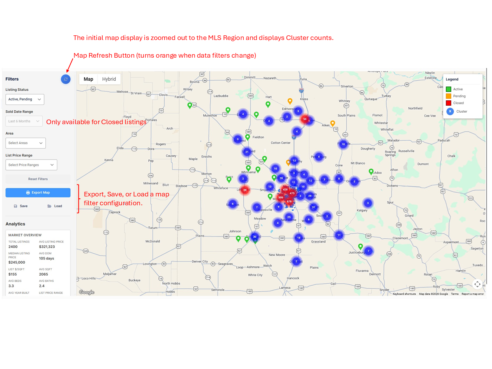
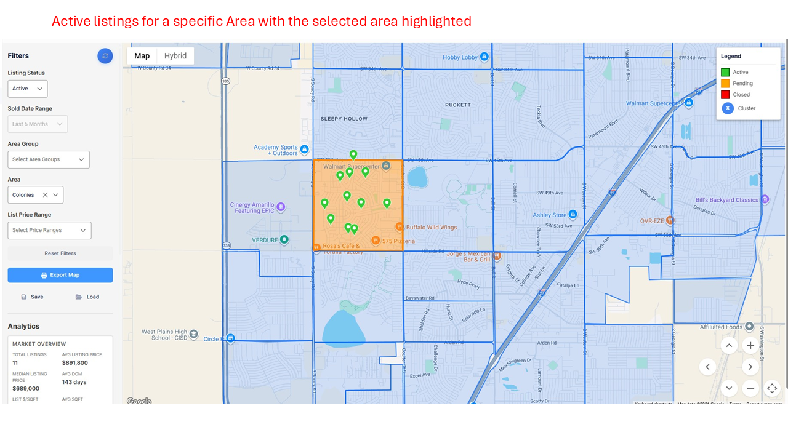

## Listing Map

The Listing Map uses a Google Maps framework to display Active, Pending, and Closed listings on the MLS Region used by an Association and its Realtors. The Filter panel lets a user select filter criteria to change the pins displayed on the map. The Blue button at the top of the Filter panel is the "Refresh" button and will turn orange when the filters have changed. The data in the Analytics section is recalculated each time the map is refreshed.

The Analytics panel calculations use the current List Price for Active and Pending listings and the Closed price for Closed listings. When MLS data is loaded each day, all Active and Pending listings are included, but the data set includes only 13 months of Closed listings. Any Closed listing older than 13 months is ignored and not displayed on the map or in reports. 

The **Listing Status** filter can be either Active, Pending, Active and Pending, or Closed. All three status values cannot be selected together to avoid confusion in the Analytics calculations.

The **Sold Date Range** filter is only available when the Status filter has Closed listings selected.

The **Area** filter allows the user to select one or more Areas from the dropdown list. The selected Areas will be highlighted on the listing map for visual reference.

If a tenant has defined **Area Groups** for their MLS Area data, an Area Group dropdown will be displayed for use. In the map example below, there are no pre-defined Area Groups, and the dropdown is not visible.

The **Reset Filters** button returns the map filters to the default of Active and Pending listing status with no other filters applied.

The **Export Map'** button opens a Print dialog with two pages: the first is the map rendering, and the second contains the Analytics values. The user can save the output as a PDF or print it if printing is available.

The **Save** button allows a user to save a map filter configuration for later use. A user can save up to 25 map filters.

The **Load** button allows a user to load a previously saved map filter.

## Listing Map - Example 1

## Listing Map - Example 2
An example of selecting a specific Area for Active listings. The selected Area is highlighted and the Analytics calculated for the pins displayed. The pin details can be viewed by clicking on the pin.

