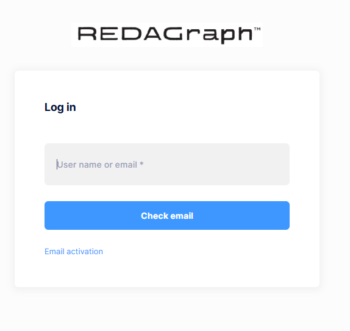

## Download and Install REDAGraph

You can download the native mobile app from both the Apple App Store and the Google Play Store. The app can be found by searching for REDAGraph. 
Once you've downloaded and installed the app, you can open it, which will present the initial login view. You will enter the email associated with your account and click "Check Email" and the application will navigate to your assigned tenant.

