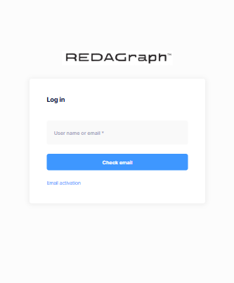

# Login

Every application user must log in. The user's login controls the data available to the user and is determined by the assigned User Roles.

The initial user login screen requires a valid email address. The email address used to log in should be the email address associated with the application's Tenant account, set up by an Administrator. Enter the user's email address and click "Check email". If there is a valid user account associated with the email, the subsequent Tenant sign-in will require your email and the initial login password assigned by your administrator. Once you are logged into the Tenant associated with the email address, you will be directed to the Tenant's Dashboard.   [Dashboard](Mobile/mobile_dashboard.md).

