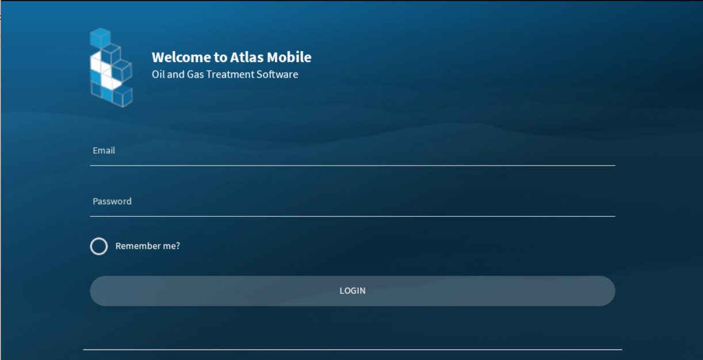

# Login

Every application user must login. The user's login controls the data available to a user and defined by the assigned User Roles.

The login screen requires an email and a password. Enter the user name and password, then click login. If you've entered 

the login information correctly you will be directed to the main [dashboard](Dashboard.md).

