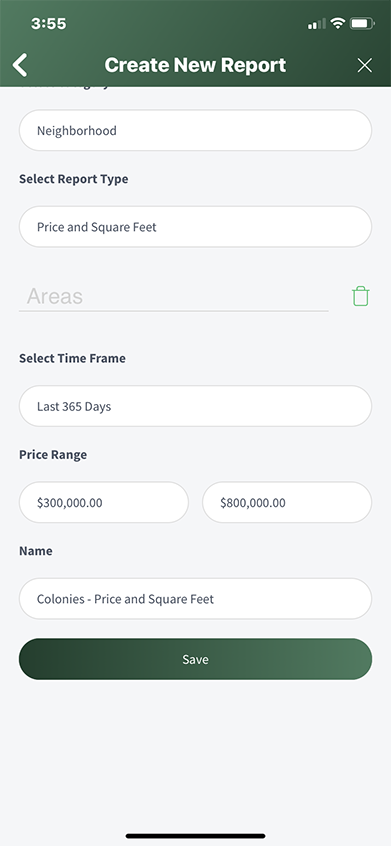

## Mobile Create Report

1. From the Dashboard, select **Reports**
2. Select the "**+**" icon in the upper right-hand corner
3. Select a **Category**
4. Select a **Report Type**
5. Select report **Areas**
6. Enter a **Report Name**
7. Select **Save**

The Report Name you provide is specific to your Report. Creating a Report in the Mobile App also makes that Report available in the Web App. In the Sample below, the new Report is Report Category of Neighborhood, Report Type of Price and Square Feet with a Price Range of 300k to 800k and a Report Name of Colonies - Price and Square Feet.

