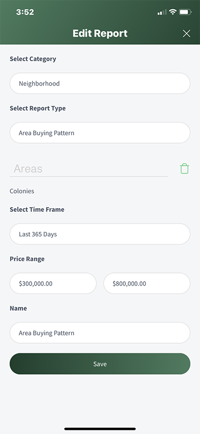

## Edit a Report (Mobile)
1. From the Dashboard, select **Reports**
2. Select a Report
3. Select the **Edit** icon (pencil and paper in the upper right-hand corner)
4. Make changes as desired
5. Select **Save**

Mobile Reports and Web App Reports are the same Report. Any edits made to a Report on the Mobile App will appear in the Web App Report.

