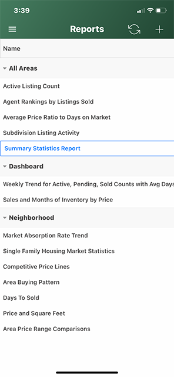
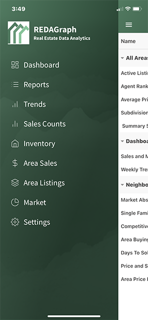

# Mobile Dashboard - Reports

In the Mobile application, the Reports tile on the Dashboard opens the Mobile Reports View. The Reports displayed are grouped by the Report Category. 

You can add new reports, edit existing reports, or delete using the Mobile Reports View. Your reports are specific to you, the user. These reports are the same report whether accessed in the Mobile application or the Web Application.

**Note**: Use the Web Application to create or manage reports, then use the Mobile application to edit report criteria or email when in the field.

You can also use the slide out menu to access the Reports View

