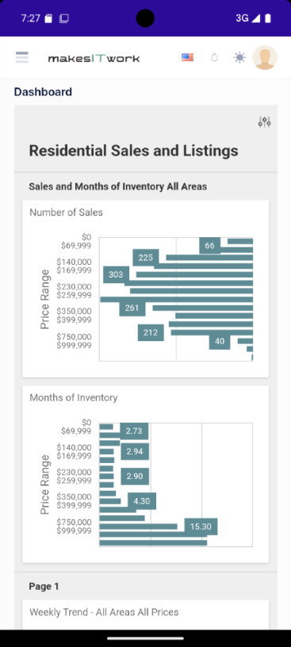

# Mobile Dashboard and Menu

The Mobile Dashboard will look different depending on the mobile device. On a phone, the screen will shrink as needed and the user may have to scroll to see button or text. The mobile application Dashboard is the same Dashboard in the web application but will look and behave differently.

