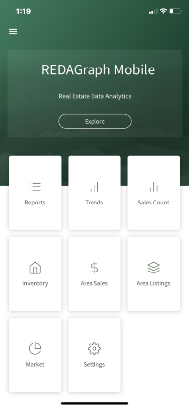

# Dashboard and Menu

The Mobile Dashboard is a collection of tiles for opening graphs, reports, or application functions. The Mobile Dashboard tiles cannot be modified by a user.

* [Reports](mobile-reports.md):  Opens the Reports View.
* [Trends](mobile-trends.md):  Graphs displaying Weekly Trends data.
* [Sales Count](mobile-salescount.md):  Displays the Number of Sales by Price Range for the last 365 days for all MLS Areas.
* [Inventory](mobile-inventory.md):  Displays the Months of Available Inventory by Price Range for all MLS Areas
* [Area Sales](mobile-areasales.md):  Displays the top 15 MLS Areas by Sold count.
* [Area Listings](mobile-arelistings.md):  Displays the top 15 MLS Areas by Active Listing count.
* [Market](mobile-market.md):  Data Report containing Market level summary statistics for all MLS Areas.
* [Settings](mobile-settings.md):  Application settings for the current user.
