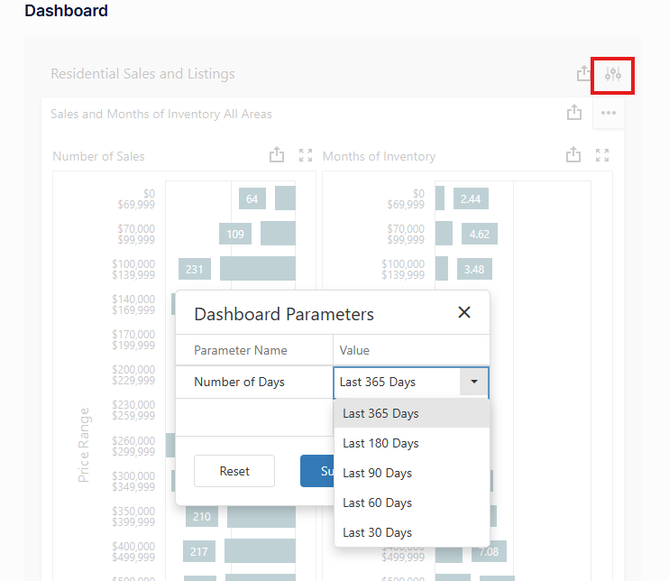

# Mobile Dashboard and Menu

* [Dashboard](mobile-trends.md):  The Tenant's Dasboard View
* [Reporting](mobile-reports.md):  Expands the Reporting Menu.

The Mobile Dashboard contains a set of predefined Graphs. 

To select a Dashboard graph, click the ellipse highlighted in yellow and select a Graph from the list.

The gauge icon on the Dashboard allows the User to select a Date Range that will be applied to most of the reports in the Dashboard, but not all.

