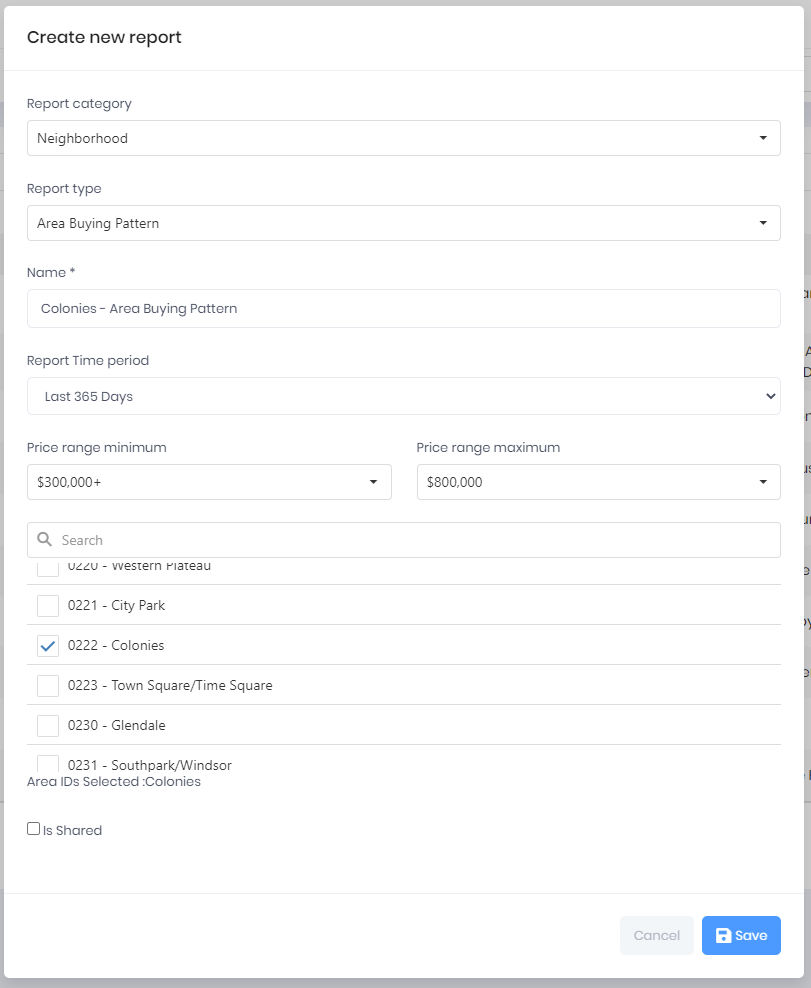

## Create a Report

1. Select **Create new report**
2. Select a **Report Category**
   - All Areas
   - Dashboard
   - Neighborhood
3. Select a **Report Type**
4. Enter a **Name** for your Report. (The Report Name you provide is only available in your list of Reports)
5. If desired, select the **Is Shared**. (This feature is available to the Administrator Role for the purpose of creating shared Reports)

***
Create Report Dialog

In the example below, the User has created a Report with a Report Category of Neighborhood, a Report Type of Area Buying Pattern, for the MLS Area Colonies, covering the past 365 Days, with a Price Range of 300k to 800k.

