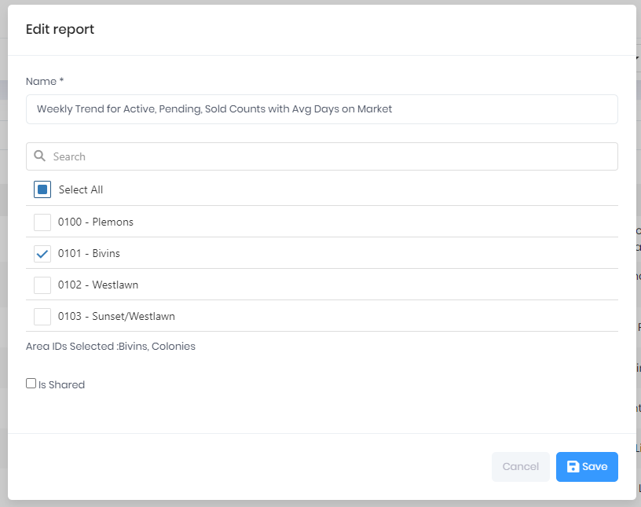

## Edit a Report

This Action enables you to change the Report name or Report Criteria. The Criteria selections available in the Edit Modal will be based on the Report Type.

Select **Actions > Edit**

For the Administrator Role, the **Is Shared** checkbox can be used to create Group Shared Reports.

