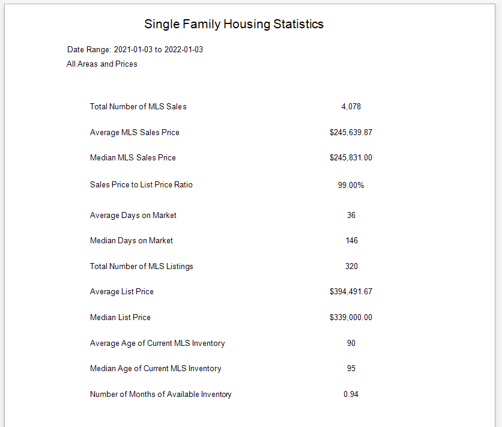

## Summary Statistics Report (Single Family Housing)

Displays basic statistics for all MLS Areas and Price Ranges, including the average, medians, and counts of the Sales and Active Listings. This Report provides a basic snapshot of the Tenant's entire MLS Market.

[Back](../report-types.md)
