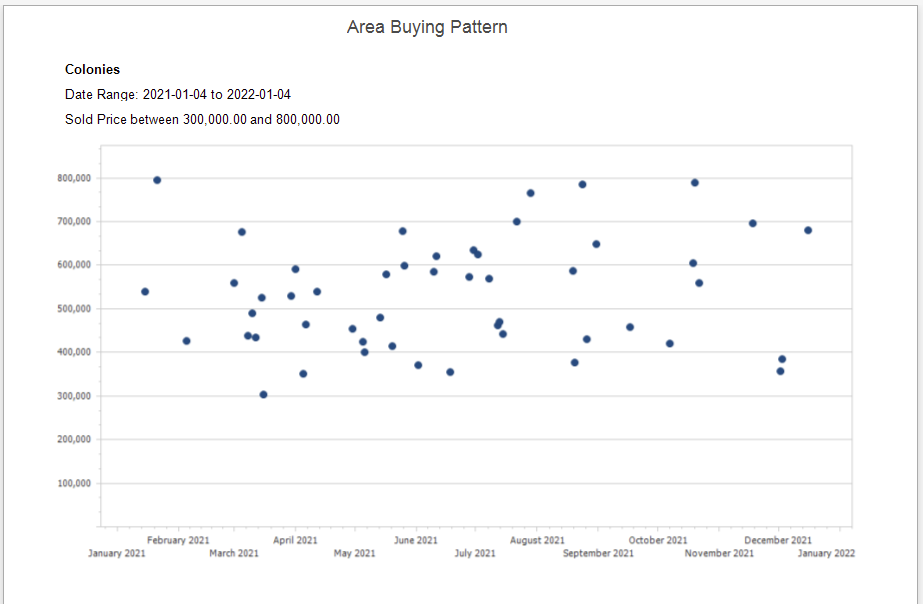

## Area Buying Pattern

A scatter diagram displaying Sold properties by Month and Year for a selected Price Range in a specific MLS Area. This graph can be used to identify, within an specific MLS Area, the buying pattern for selected Price Ranges. The report is useful for identifying the most active times to sell or purchase a property in a given MLS Area.

[Back](../Reports/report-types.md)
