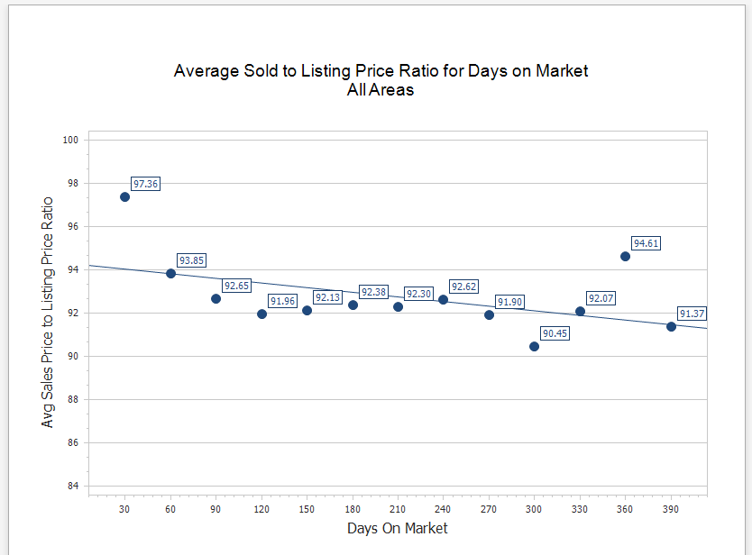

## Average Sold to Listing Price Ratio for Days on Market

Graph of the Sold to Listing Price Ratio for All MLS Areas and Price Ranges. Provides an easy way to see how Days On Market impacts the Sales Price over time.

[Back](../report-types.md)
