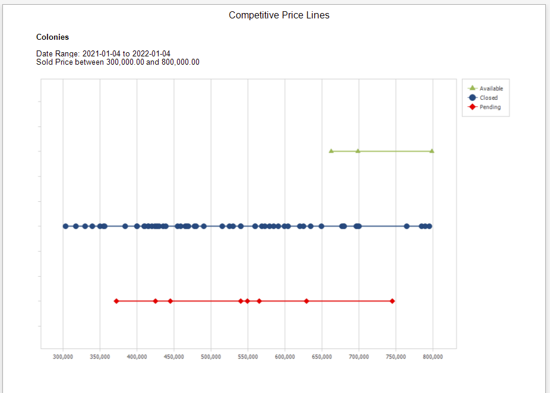
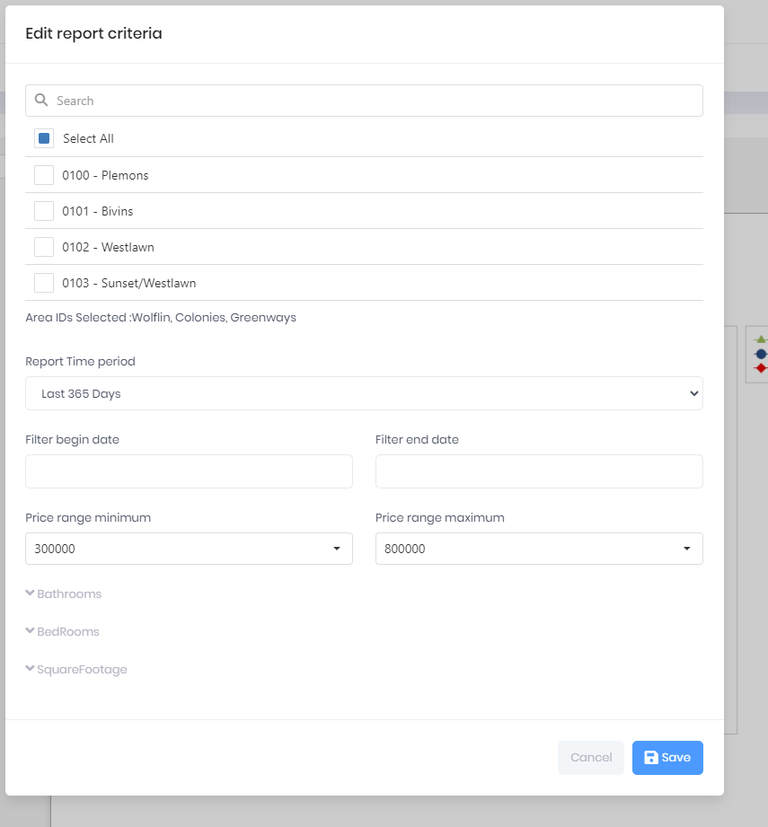

## Competitive Price Lines

The graph displays three lines with data points for Active Listings, Sales, and Pending Sales for a specific MLS Area, Price Range and Date Range. The graph is useful to identify where a property in an specific MLS Area will fall in regards to the Inventory avaialable and demand. For example, if the Sold properties are congregated in a narrow price range and a seller's property (Active Listing) is outside of the concentrated prices, that seller can expect lower demand for their property.

In the example, the bulk of the Sold properties (blue line) for the Price Range of 300k to 800k are below the 650k price. The Available properties (green line) may experience a lower demand in the near term, as their price is above 650k.

***
Report Criteria

[Back](../report-types.md)
