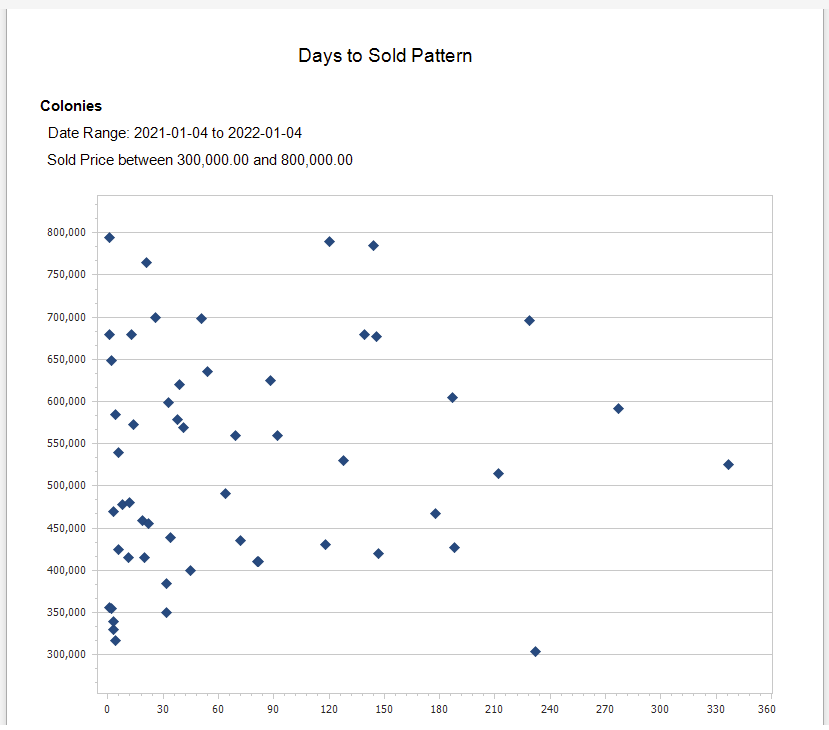

## Days To Sold

A scatter diagram displaying the number of days to a Sold status for Properties in the selected MLS Area based on a specific Price Range and Date Range. The report is useful for identifying what property price points sell the quickest in a given MLS Area.

***
Report Criteria

[Back](../report-types.md)
