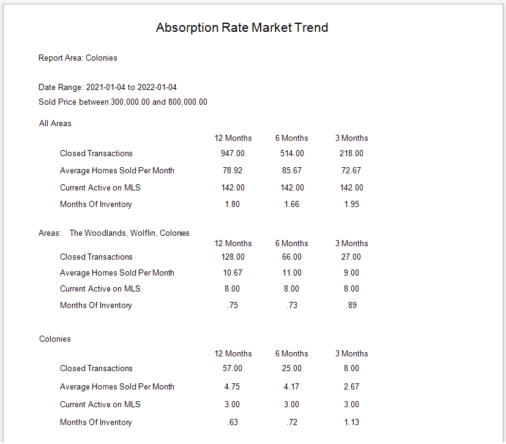
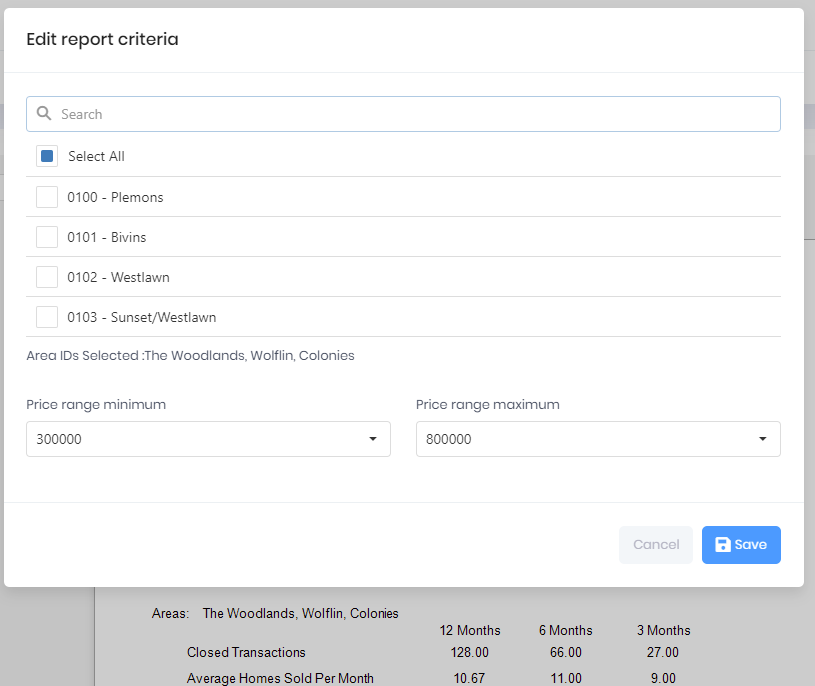

## Market Absorption Rate Trend

The Report contains three sections: the first section displays all MLS Area data for specific Price Range; the second section displays the MLS Area data for a set of selected competitive MLS Areas; and the third section displays the calculations for a specific MLS Area included in the competetive Area List. Each individual Area will display a page in the total report output. The report is useful to compare the Sales activity and Inventory for competing areas.

***
Report Criteria

[Back](../report-types.md)
