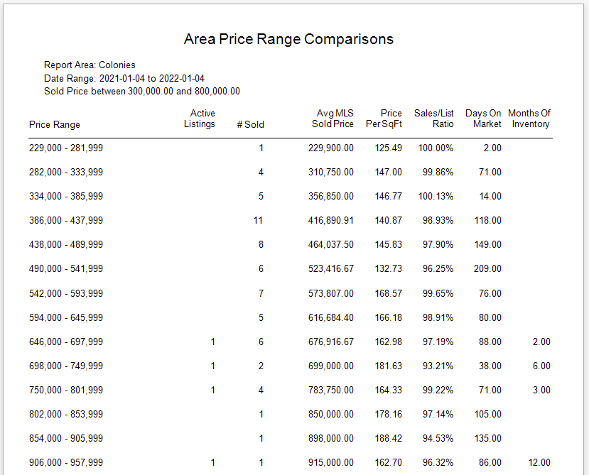
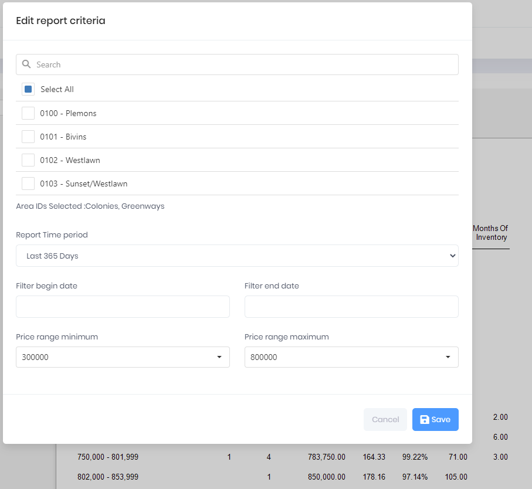

## Area Price Range Comparisons

The report displays a basic set of Sales statistics for a selected Set of MLS Areas for a given Date Range. The Price Ranges used in the report are auto calculated based on the min and max sold property price for the Date Range in the specific Area. The report will contain a page for each Area selected.

***
Report Criteria

[Back](../report-types.md)
