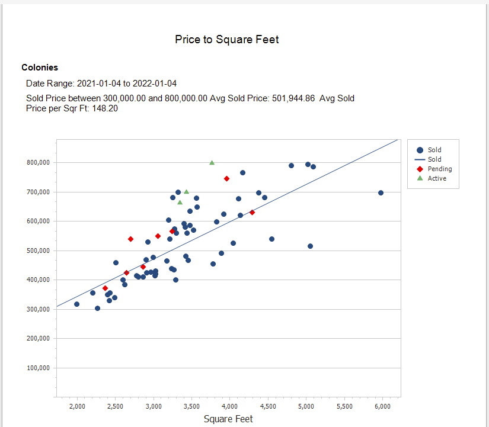
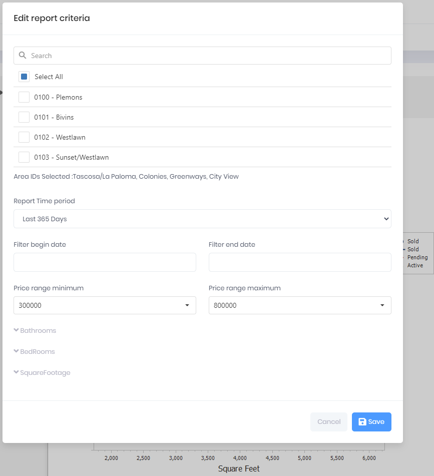

## Price To Square Feet

A scatter diagram with Active Listings, Sold, and Pending Sales for a selected MLS Area, Price Range and Date Range by Price and Square Foot. Additionally, a Sold Property Regression line is caluculated to provide a reference for the trend of Sold Properties. The report is useful for both buyers and sellers and gives an indication of the price a particluar property is being offered (Active Listing) or Pending in reference to the Sold Property trend line. For example, Active Listings above the Sold Property Regression line may be over priced, with all things being equal. In some cases, Active Listings above the Sold Regression Line may have special features that warrant a higher price. Also, sellers with Active Listings below the Sold Regression Line for a Price and Square foot value may have an easier time getting to a Sold status

***
Report Criteria

[Back](../report-types.md)
