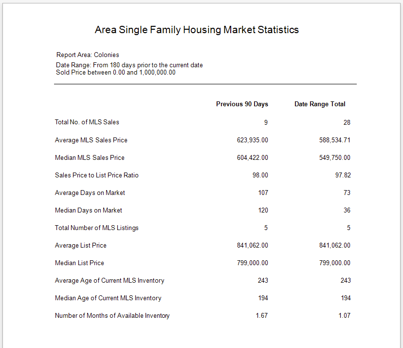
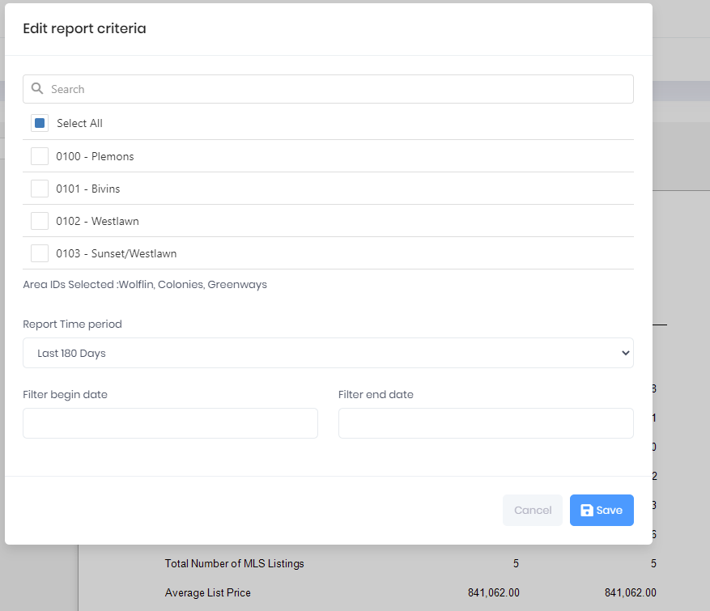

## Single Family Housing Market Statistics

This Report provides summary statistics for a specific MLS Area for a specific Date Range. Additionally, it calculates the previous 90 days of data from the End Date of the total Date Range.

***
Report Criteria

[Back](../report-types.md)
