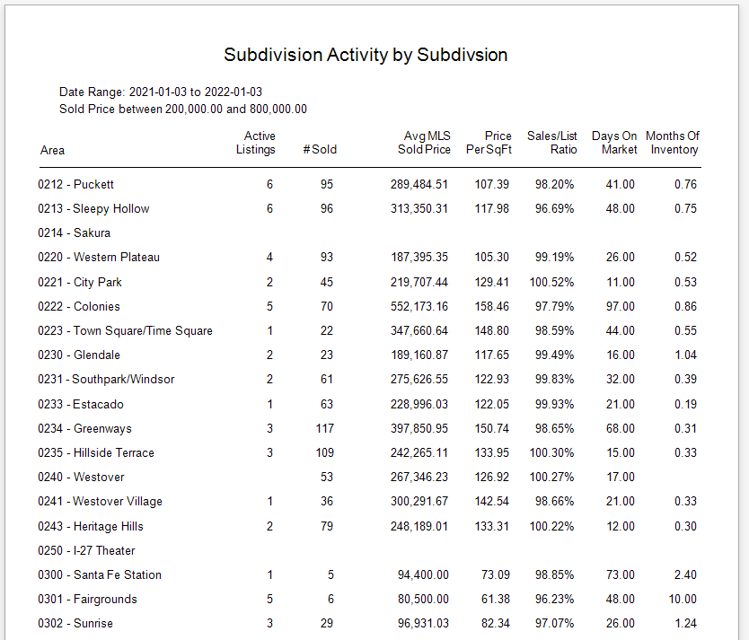

## Subdivision Listing Activity (Single Family Housing)

Displays the	Basic Sales and Listing information for all MLS Subdivisions (Neighborhood) for the past 365 Days using a Price Range specified by the User. The Report allows a user to select a Price Range for the report using a Report Criteria.

[Back](../report-types.md)
