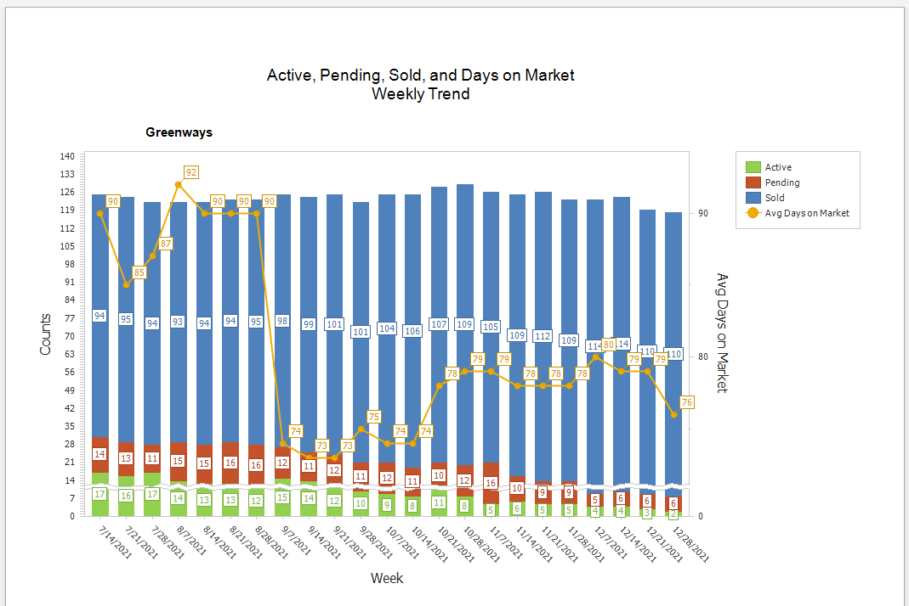
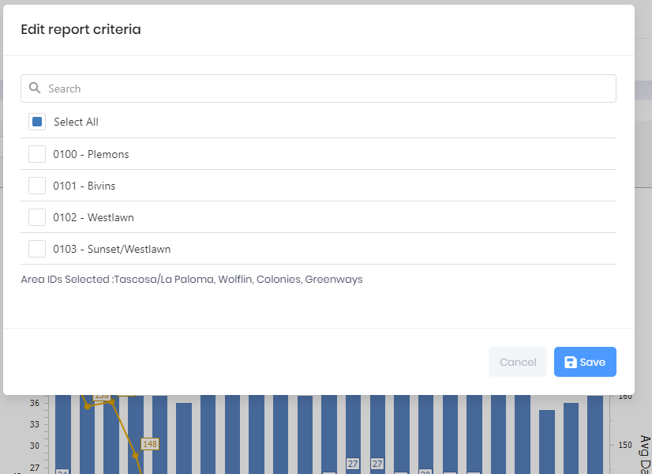

## Weekly Trend for Active, Pending, Sold Counts with Avg Days on Market

A stacked bar graph displays the Sold, Active Listing, and Pending count for the date graphed. The graph uses a daily snapshot taken on the 7th, 14th, 21st, and 28th day of each month and then calculates the Days on Market value for that week, which is indicated by the Gold Dots with the Day scale on the right hand side of the graph. The graph displays the last 24 weeks of data with the new stack appearing on the right side of the graph.

***
Report Criteria

[Back](../report-types.md)
