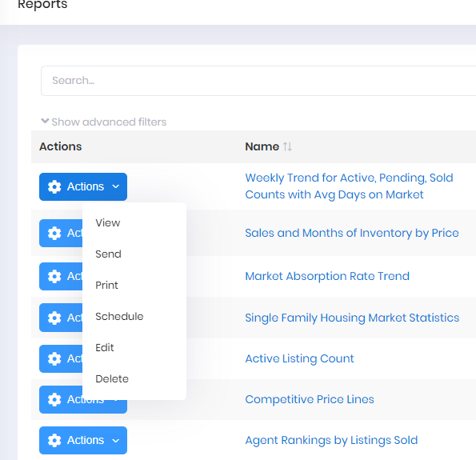

## Report Actions

While viewing the Reports menu, you have access to 5 specific actions: 

- View
- Send
- Print
- Schedule
- Edit
- Delete

These actions are displayed in the Actions menu to the left of each Report. Any Actions you select will only affect the Report row for that action.

