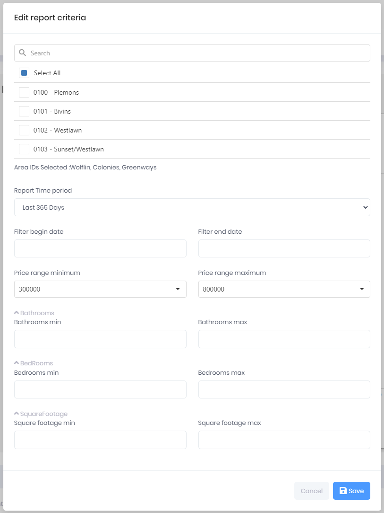

## Report Criteria

Report Criteria is used by some but not all Report Types to filter the data used in a selected Report's output. The Report Type determines which filtering criteria is available for a Report. Some Reports may only allow a Price Range selection, while other Reports may allow filtering by the number of Bedrooms, Bathrooms, and property Square Feet. 

The example below shows all the Report Criteria filters available, while the Report Type determines which of the filters are displayed. If a User modifies the Report Criteria then saves the criteria, the Report is re-rendered using the new criteria. When a user opens a Report from either the mobile app or the web app, the Report Criteria last saved will be used for the Report output.

The **Search** field in the Report Criteria dialog is used to search for MLS Areas in the Tenant's Area (Neighborhood) list.

The **Area IDs Selected** text displays the Areas a user has selected to be included in the Report output. 

The **Report Time period** allows the user to specify how many days will be included in the Report output.

The **Filter Begin Date** and **Filter End Date** fields allow a user to specify dates if they want something other than the Report Time period values. 

