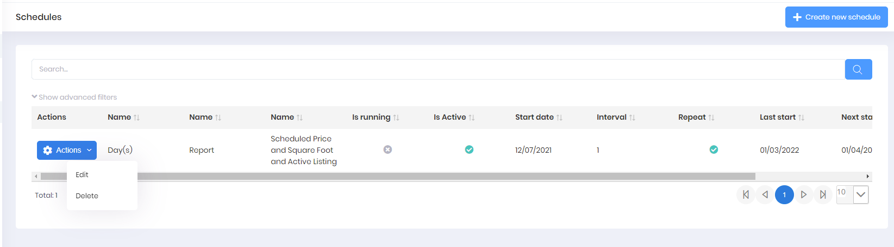
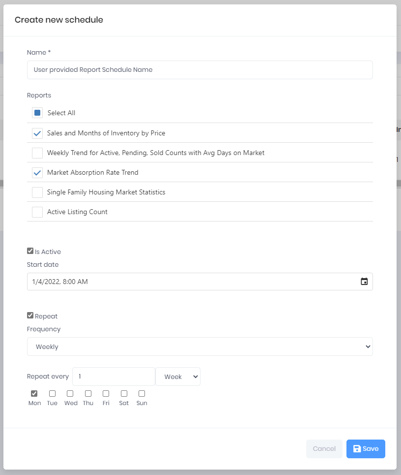

## Report Schedule

The Report Schedule feature allows a user to select a Report or Reports previously created in the Web Application or Moblie App and have those reports emailed to the the user's email address at a scheduled interval. The selected Reports are rendered using the Reports current Report Criteria. The rendered Reports are attached to an email as a PDF or PDFs along with a link to download the Reports.

A User can Create, Edit, or Delete a Report Schedule. Each row in the Report Schedules View allows two Actions: Edit and Delete and those Actions effect only the Report Schedule selected. Report Schedules are specific to a User and not available to any other User.

***
Create new schedule

The **Name** field is a required value supplied by the User. Select a Report Schedule Name that provides an indication of what is included in the scheduled output.

The **Reports** displays a list of Reports created by the User and available for a Report Schedule.

The **Is Active** check box indidates the status of the Report Schedule.

The **Start Date** also includes a Time value which determines the time of day the Report output will be rendered and emailed to the User's registered email address.

In the example below, the User has indicated the two Reports selected will be emailed every Monday at 8:00 AM.

