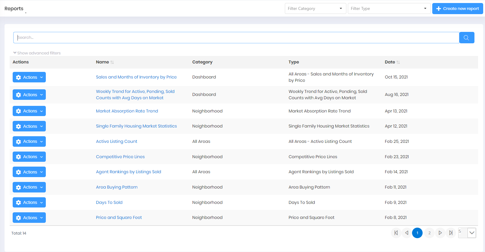

## Report View

**Reporting > Reports**

The Reports View displays the list of all existing Reports available to the current User. 

You can **Search** for a specific Report Name in the Search field. A User can also filter Reports by Report Category or Report Type using the Filter dropdowns at the top of the Report View. Additionally, a User can apply filters (select **Show advanced filters**) to further narrow the list of Reports displayed.

You can create a new Report, or perform **Actions** on existing Reports using the button beside each row in the View.

If you have more Reports than can be displayed on one page, use the navigation menu below the Reports List to view different pages.

