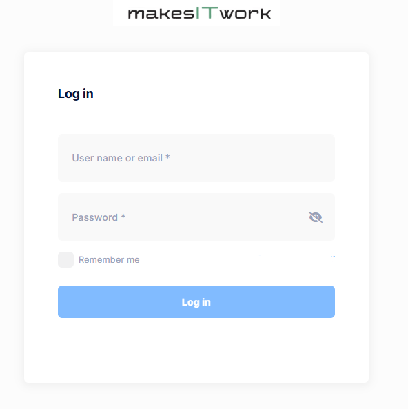
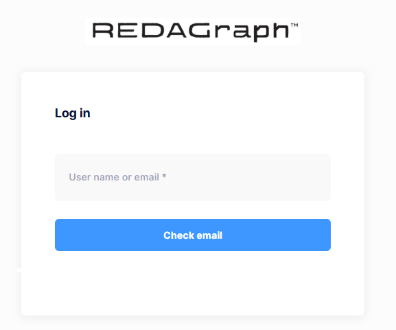

# Quick Start Guide

> This document explains how you will log in to REDAGraph for the first time. You will need your email and the initial password you received (via email) before you begin. If you do not have your application login credentials, please contact your company or association representative for login credentials.

**Web Application**

Navigate to your agency's dedicated URL: https://my-agency-id.redagraph.com (the my-agency-id value is specific to your organization).
Enter your email address and password assigned by your Administrator and click Login.

**Mobile Application**

Launch the REDAGraph mobile app and you will be presented with the login screen.
Enter your email address and click Check Email. The application will automatically identify and direct you to your organization's tenant.
Once redirected, enter your email address and the initial password assigned by your Administrator and click Login.

**Both Platforms**

If prompted to change your password upon first login, please do so before proceeding.
Once logged in, you will be taken to the application dashboard.
Congratulations! You're ready to start using REDAGraph!

**Getting the Mobile App**

To install the REDAGraph mobile application, visit the **Google Play Store** or **Apple App Store** on your device and search for **REDAGraph**.

If you'd like to learn more about the system, go to  [Navigating REDAGraph](../Web/navigation.md).

