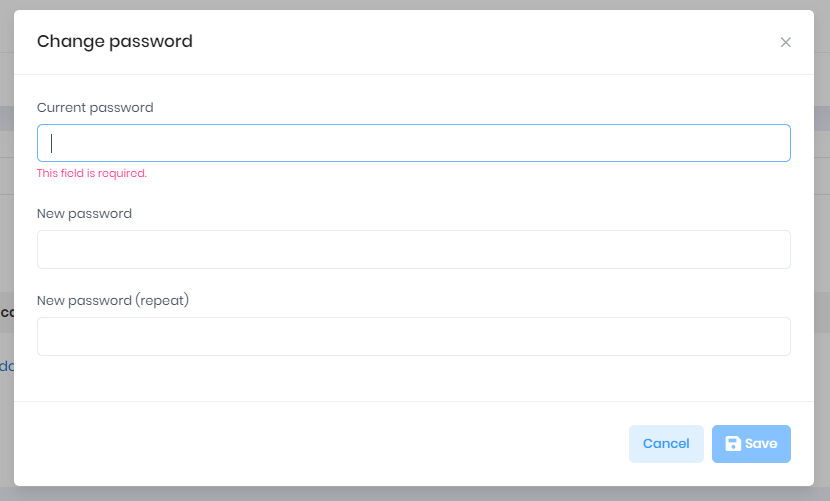

## How to Change Your Password
1. Select your **User Icon** in the upper right-hand side of the screen
2. Select **Change Password**
3. Enter your **Current Password**, then enter your **New Password** (twice, as indicated)
4. Select **Save**

[Back](../Account/settings.md)
