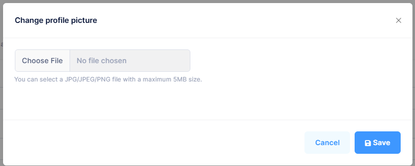

# How to Change Your Profile Picture
1. Select your **User Icon** in the upper right-hand side of the screen
2. Select **Change Profile Picture**
3. Select **Choose File**
4. Select **Save**

**Note:** the maximum file size is 5MB\
**Note:** accepted formats include: JPG, JPEG, PNG

[Back](../Account/settings.md)
