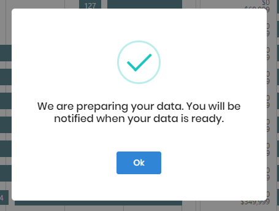
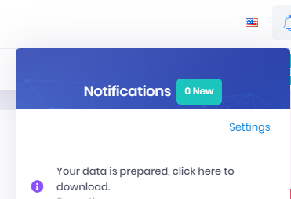

# How to Download Collected Data

This feature compiles any chat text, a bio photo, and the profile information into an Excel file, which is then added to a downloadable zip file. When the data is ready to download, you will receive a Notification with a link to download the zip file.

1. Select your **User Icon** in the upper right-hand side of the screen
2. Select **Download Collected Data**

3. Check your Noifications using the Bell icon in the upper right-hand side of the Application and use the Notification link to download the file.

