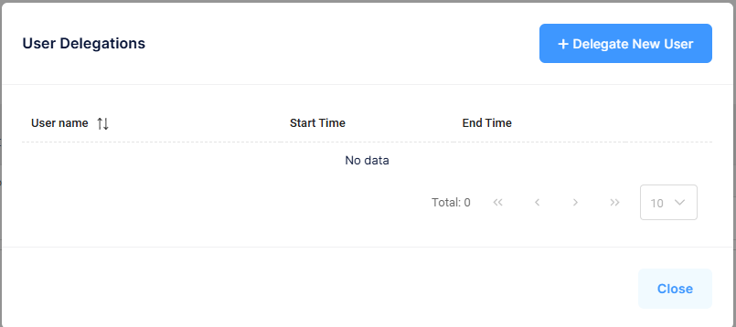

## Manage Authority Delegations

Authority Delegations allows a user to delegate their login access to another user within the same Tenant (Company).

### How to Manage Authority Delegations
1. Select your **User Icon** in the upper right-hand side of the screen
2. Select **Manage Authority Delegations**
3. Add or remove delegated users as needed

[Back](../Account/settings.md)
