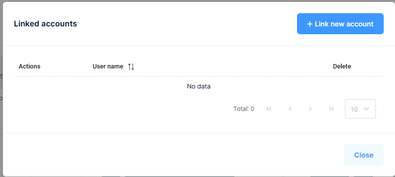

## Manage Linked Accounts

Linked Accounts allows a user to link multiple accounts within the same Tenant (Company), making it easy to switch between them without logging out.

### How to Manage Linked Accounts
1. Select your **User Icon** in the upper right-hand side of the screen
2. Select **Manage Linked Accounts**
3. Add or remove linked accounts as needed

[Back](../Account/settings.md)
