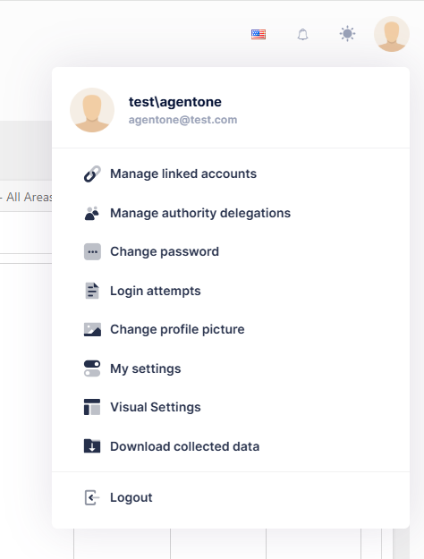

# User Settings

User Settings are accessed with the icon located in the right-hand corner of the web application.

## User Settings Panel
A variety of tasks can be performed from the User Settings Panel

1. [Manage linked accounts]
2. [Manage authority delegations]
3. [Change Password](../Account/change_password.md)
4. [Login Attempts](../Account/login_attempts.md)
5. [Change Profile Picture](../Account/change_profile_picture.md)
6. [My Settings](../Account/my_settings.md)
7. [Visual Settings](../Account/visual_settings.md)
8. [Download Collected Data](../Account/download_collected_data.md)
