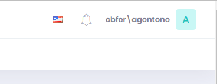
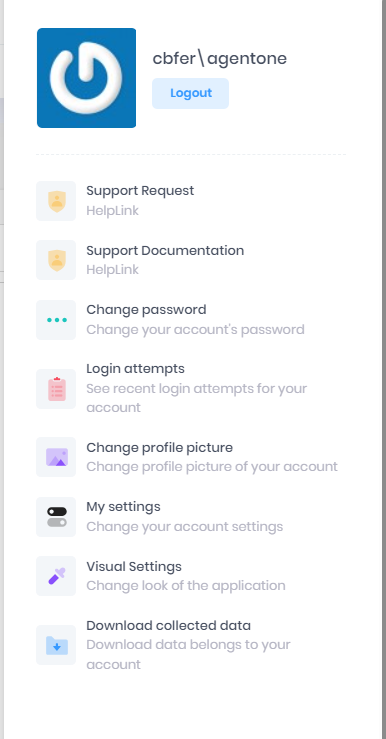

# User Settings

User Settings are accessed with the icon located in right hand corner of the web application.

## User Settings Panel
A variety of a tasks can be performed from the User Settings Panel

1. [Support](../Account/support.md)
2. [Change Password](../Account/change_password.md)
