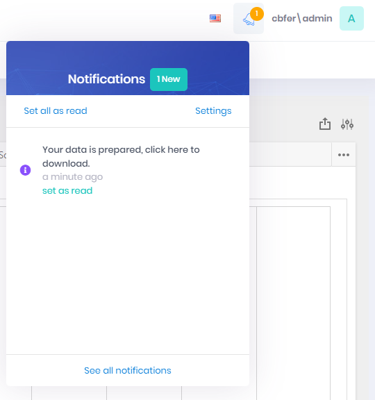
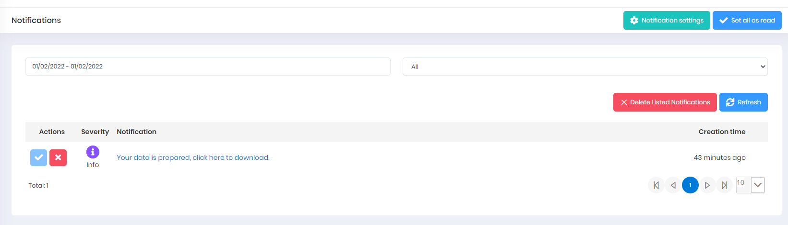

# Notifications

The Notifications feature provides quick access to in-app communication.

## View Notifications
To view **Notifications**, select the bell icon in the upper right-hand corner of your screen
**Note**: The number of unread Notifications will be displayed on the bell icon.

## Search for a Specific Notification
1. While viewing the Notifications window, select **See All Notifications**
2. Adjust the **Date Range** filter and/or the **Read/Unread** filter to narrow the search results

## Set Notifications as Read
1. While viewing the Notifications window, select **Set All As Read**

## Adjust Notifications Settings
1. While viewing the Notifications window, select **Settings**
2. Adjust the **Receive Notifications** control to determine whether you want Notifications displayed
3. Select **Save**

