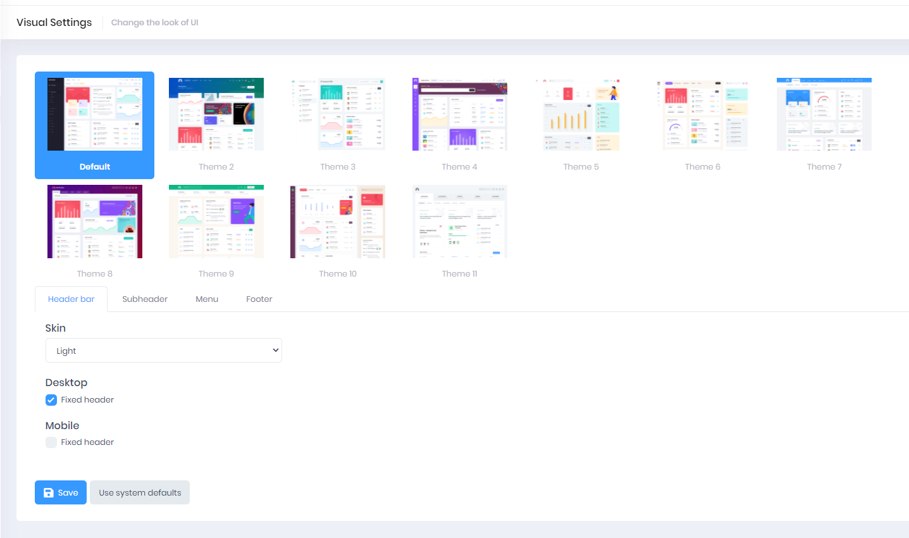

# How to Change Application Appearance

1. Select your **User Icon** in the upper right-hand side of the screen
2. Select **Visual Settings**
3. Select desired appearance from the built-in templates
4. Use the tabs to alter the **Header Bar**, **Subheader**, **Menu**, or **Footer**
5. Adjust **Desktop** and **Mobile** settings
6. Select **Save**

**Note**: select **Use System Defaults** to override any changes you made.

