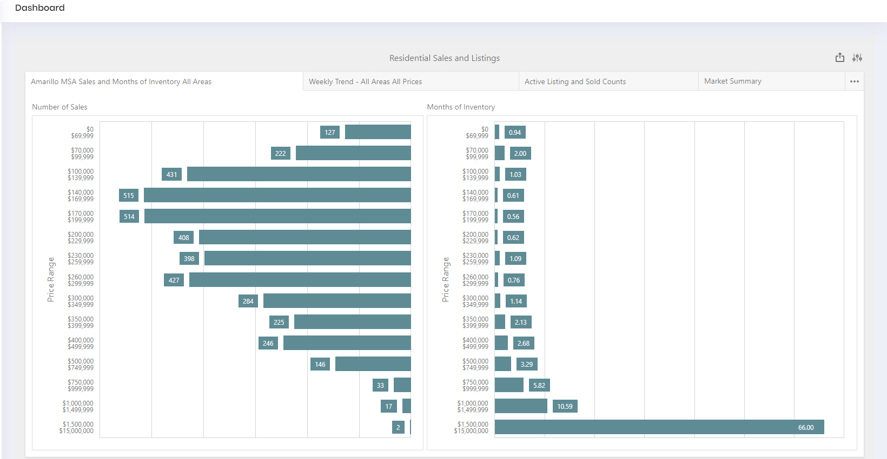

# Dashboard Customization

The current version of REDAGraph does not provide user level customization. The user level Dashboard Customization feature will be available in version 2.x.

The appliction splash screen image, used on the login page, will vary according to the images used by your company.

After a successfull login you will arrive at a Dashboard screen similiar to the one below. 

 ## Next Step

* [Navigating REDAGraph](/navigation.md)
