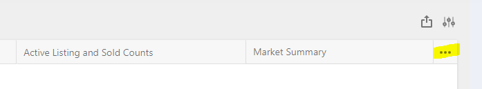
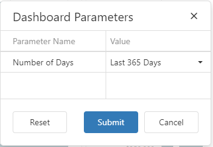
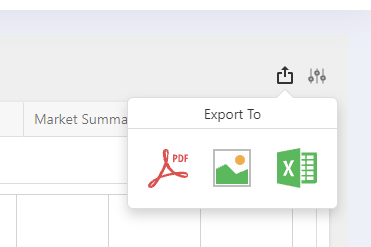

# Dashboard Navigation

The Dashboard has a set of Tabs containing Dashboard level Reports. If the Dashboard has additional reports not displayed, use the ellipse (highlighted) to access the additional reports.

For some dashboard reports additional data filter may be available. The Dashboard filter is accessed using the Sliders icon next to the Export icon. Select one of the filter values and click Submit.

Selected reports can be expanded to full screen mode by clicking on the four arrows icon in the right corner of the report.

To [Export](/export.md) a selected report use the Export icon.

