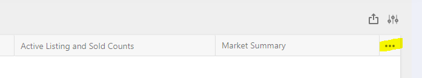
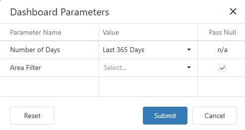
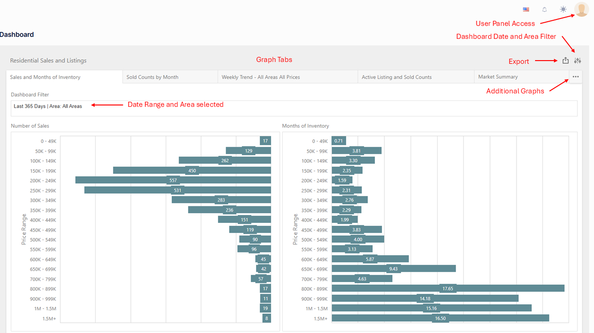
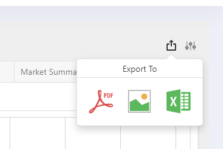
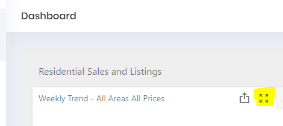

# Dashboard Navigation

The Dashboard has a set of Tabs containing Dashboard level Reports. If the Dashboard has additional reports not displayed, use the ellipse (highlighted) to access the additional reports.

***

For some dashboard reports additional data filters may be available. The Dashboard filter is accessed using the Sliders icon next to the Export icon, which opens the Dashboard Parameters dialog.

The **Number of Days** parameter sets the date range used for the report's data.

The **Area Filter** parameter allows one or more Areas to be selected to limit the report's data to those Areas.

The **Pass Null** column can be ignored. It is a system column that cannot be hidden and is not intended for user interaction.

Select the desired filter values and click Submit and the associated report data will be updated.

***

For the Sales, Months of Inventory, and Sold Counts by Month graphs, an additional Area filter is available. Select one or more Areas to limit the graph's data to those Areas.

***

To [Export](export.md) a selected report use the Export icon.

***

Selected reports can be expanded to a full screen viewing mode by clicking the four arrows icon in the right corner of the report. The small four arrows icon appears when the report is the selected and active report.

 ## Next Step

* [User Settings](../Account/settings.md)

