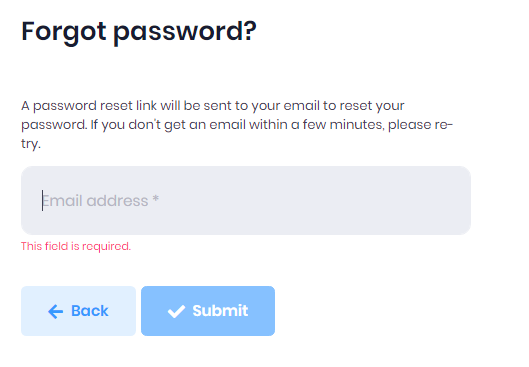

# Forgot Password
If a user forgets their password, it can be retrieved by clicking the **Forgot Password** link. On the forgot password screen, enter your email address and a password reset email will be sent to the email address.

After receiving your password reset email, click to Reset button in the email and the user will be redirected to the password reset page where the user can change their password.

