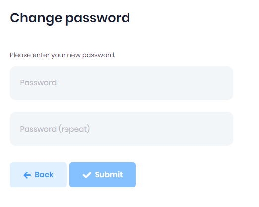

# Web Log In

For new users and users who have logged out of the Web application, the first Login View you see will prompt you to enter your account's email address and password. For the mobile application, enter the email address associated with the account and click "Check email", then continue logging into your assigned tenant.

Generally, during your first log in you will be required to change your password.

After a successful login you will be redirected to the Web Dashboard.

### User Lockout
 Users can be locked out for a specified duration if they have entered incorrect credentials within a given amount of time. Contact your Company Application Manager to unlock your account if that happens.

 ## Next Step

* [Web Application Dashboard](../dashboard/customizing.md)
