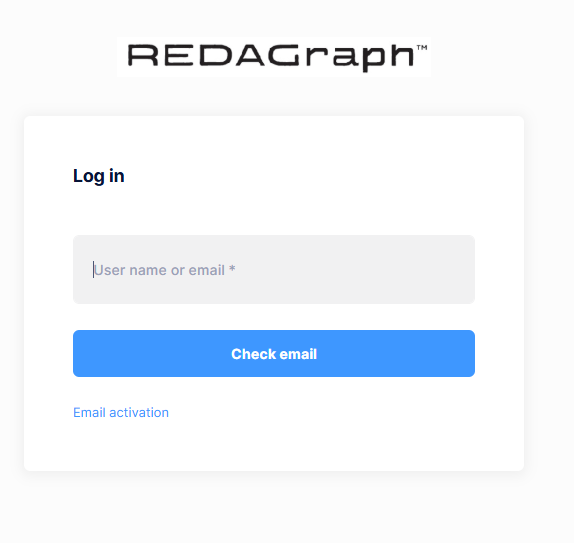

# Web Log In

For new users and users who have logged out of the application, the first Login View you see will prompt you to enter your account's email address.
Enter the email address associated with the account and click "Check email".

If a valid account is found, you will be prompted with the Tenant Login View.

Use your assigned user id or email and password to log in the web application. 

If you do not have an account please contact your Company's REDAGraph Application Manager to get your account created.

Generally, during your first log in you will be required to change your password.

After a successful login you will be redirected to the Web Dashboard.

### User Lockout
 Users can be locked out for a specified duration if they have entered incorrect credentials within a given amount of time. Contact your Company Application Manager to unlock an account.

 ## Next Step

* [Web Application Dashboard](../dashboard/customizing.md)
