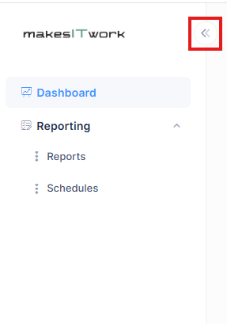
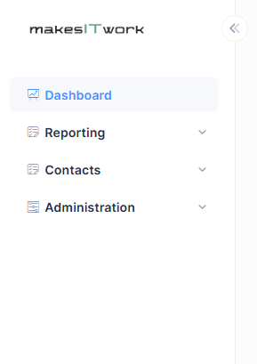
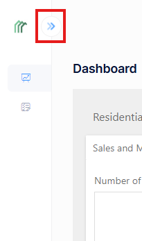

# Navigation

Navigating the REDAGraph web application is key to maximizing the application's features. 

The quickest way to go from section to section within REDAGraph is to use the side navigation bar and select the application feature you want to use.
Some menu options will not be available, depending on the User Role assigned. The Administrator Role will have more menu options than the Agent Role.

Note: the menu can be collapsed and expanded to the side using the two arrows highlighted.

Agent Role Menu 

Administrator Role Menu

Menu Collapsed

Available navigation options:

- ###### Dashboard
   - The dashboard is the web application landing page and provides a quick overview of a Tenant's MLS Market data.
- ###### Reporting
   - Reports: A list of Reports available to or created by a user for the assigned application Role.
   - Schedules: A report or reports the user has created and can schedule for automatic email delivery to the application user.
- ###### Contacts (Admin user)
   - Contacts: A User's Contacts are available for emailing or texting graphs and data report output. The ability to Import Contacts from other sources is provided.
   - Contact Lists: An organizational feature for grouping different Contacts into a specific list.
- ###### Administration (Admin user)
   - Administration is where user information and application settings are configured for the Tenant's application by Administrators.
   - Only users with the Administrator role will see the Administration menu options
