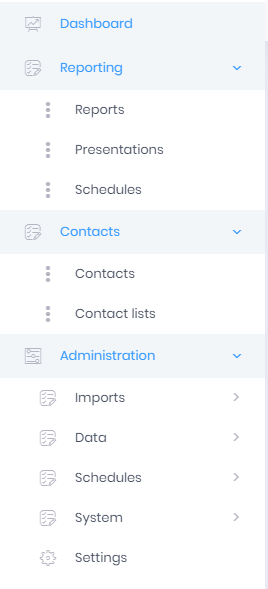

# Navigation

Navigating the REDAGraph web application is the key to getting the most out of the application features. 

The quickest way to go from section to section within REDAGraph is to use the side navigation bar and select the application feature you want to use.
Some of the menu options will **not** be available. The options visible are determined by the assigned application Role for the user's account. The Administrator Role will have more menu options than an Agent Role.

| Adminstrator Role Menu                                | Agent Role Menu                                 |
|:-----------------------------------------------------:|:-----------------------------------------------:|
| |                                     |

Available navigation options:

- ###### Dashboard
   - The dashboard is the web application landing page and provides a quick overview of a Tenant's MLS Market data.
- ###### Reporting
   - Reports: A list of Reports available to or created by a user for the assigned application Role.
   - Presentations: A special report type utilizing the REDAGraph PowerPoint Applicaiton Add-In to create PowerPoint Presentations with embedded REDAGraph Reports. Available to the Admin Role only.
   - Schedules: A report or reports the user has created and can schedule for automatic email delivery to the application user.
- ###### Contacts
   - Contacts: A User's Contacts available for emailing or texting graphs and data report output. The ability to Import Contacts from other sources is provided.
   - Contact Lists: An organizational feature for grouping different Contacts into a specific list.
- ###### Administration
   - Administration is where user information and application settings are configured for the Tenant's application by Administrators.
   - Only users with the Administrator role will see the Administration menu options
